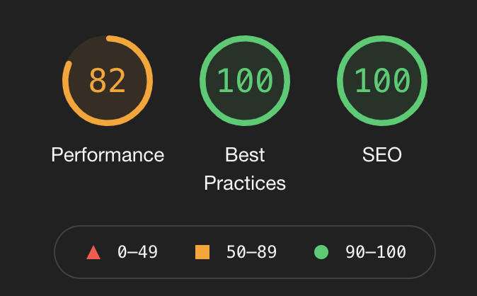

# the pixel portraits

 🎨 pixel portraits on the blockchain ~ inspired by cryptopunks but in no way affiliated

## dapp

this is all of the source code that runs the pixel portraits dapp (https://www.thepixelportraits.me)! we've spent a long time and a lot of work learning and crafting and we wanted to share what we've put together with the community.

please note this is a project that we run but do not actively support for all circumstances or users! if you have any issues please feel free to contact us, but unfortunately we don't have the time to support this as a platform for general use!

we're also constantly working to get these as high as possible!

## our thinking

we want to try and make the best experience possible for our users! we're constantly tweaking things, working away and seeing if we can improve not only the ux and ui but performance, page weight and we like to make sure we're also satisfying our own tech needs by using modern libraries and stacks! we love what we do and we hope it comes across in our dapp.

## usage

you'll notice that we've put this out as is without any individual instructions! you'll also notice a ton of the constants need filling in! this is for you to do should you want to lift the code. this isn't intended as a 1 stop shop for commission based dapps as it quite literally is bespoke to our studio, but we hope it helps people think differently about what we do!

the package.json files contain all of the run commands you would need, we obviously choose to use certain things like aws to handle and store most of our data, so you can easily tweak the code to suit your needs should you want to do it differently!